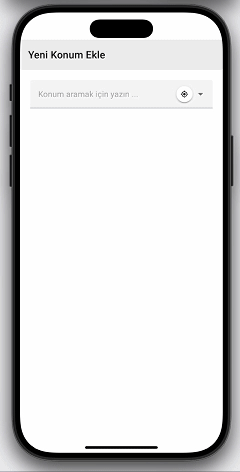
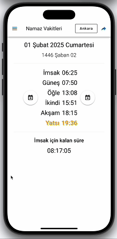

# Vakti App [(English)](README.md)

  [](https://github.com/canbax/vaktiapp/blob/main/LICENSE)

Ücretsiz, reklamsız, açık kaynaklı ve şık Namaz Vakitleri uygulaması. [Vakti App.com](https://vaktiapp.com) üzerinden kullanılabilir. Yer tespiti için https://github.com/canbax/namaz-vakti-api kullanır. Bunun dışında internet kullanmaz.

<p align="center">
  
</p>

## Özellikler

### İnternet gerektirmez

Bir yer seçildikten sonra, vakit bilgilerini getirmek için internete ihtiyaç duymaz.

### Vakti paylaşın

Vakit verilerinin linkini paylaşın. Böylece arkadaşlarınız vakitleri tek tıklamayla görebilir. Ayrıca vakitleri kendi web sitenize de "widget" olarak gömebilirsiniz.

[Ankara](https://www.vaktiapp.com/share?city=311034&theme=light&isShowHijri=1&year=YYYY&month=MMMM&weekDay=DDDD&time=XX%3AYY%3AZZ&method=Turkey&madhab=shafi&zoom=1&language=tr), [İstanbul](https://www.vaktiapp.com/share?city=311922&theme=light&isShowHijri=1&year=YYYY&month=MMMM&weekDay=DDDD&time=XX%3AYY%3AZZ&method=Turkey&madhab=shafi&zoom=1&language=tr), [İzmir](https://www.vaktiapp.com/share?city=311955&theme=light&isShowHijri=1&year=YYYY&month=MMMM&weekDay=DDDD&time=XX%3AYY%3AZZ&method=Turkey&madhab=shafi&zoom=1&language=tr) için namaz vakitleri

<p align="center"> 
</p>

### Hicri Takvim

Dini günleri "Dini Günler" menü öğesinden görebilirsiniz.

Hicri takvim hesaplamaları herhangi bir üçüncü taraf uygulama kullanılmadan yapılır. Mantık [HijriDate.ts dosyası](https://github.com/canbax/vaktiapp/blob/master/src/util/HijriDate.ts) içindedir.

## Çeşitli Özelleştirmeler

- Birden fazla tema (Koyu veya Açık)
- Dil değiştirme (Türkçe, English, Deutsch, Italian, Pусский, Española, فارسی, Français, Chinese, عربى, Indonesia, Kazakh, Korean, Kyrgyz, Malay)
- Hicri tarihi göster veya gizle
- Yakınlaştırma seviyesini değiştir
- Birden fazla tarih formatı
- Birden fazla saat formatı
- Birden fazla vakit hesaplama yöntemi (Türkiye varsayılan)

# Geliştiriciler için Proje Kurulumu

```sh
npm install
```

Geliştirme için Derleme ve Sıcak Yeniden Yükleme

```sh
npm run dev
```

Tür Kontrolü, Derleme ve Üretim için Minimize etme

```sh
npm run build
```

Vitest ile Birim Testlerini Çalıştırma

```sh
npm run test
```

## Playwright ile Uçtan Uca Testleri Çalıştırma

### İlk çalıştırmada tarayıcıları yükle

`npx playwright install`

### CI üzerinde test yaparken, önce projeyi derlemelisiniz

`npm run build`

### Uçtan uca testleri çalıştırır

`npm run test:e2e`

### Sadece Chromium üzerinde testleri çalıştırır

`npm run test:e2e -- --project=chromium`

### Belirli bir dosyanın testlerini çalıştırır

`npm run test:e2e -- tests/example.spec.ts`

### Testleri hata ayıklama modunda çalıştırır

`npm run test:e2e -- --debug`

### ESLint ile Lint Çalıştırma

`npm run lint`

### Mobil uygulamaları senkronize et

`npm run sync-apps`
