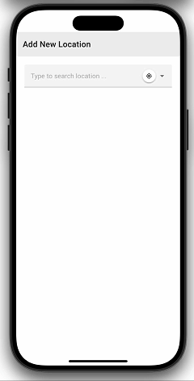
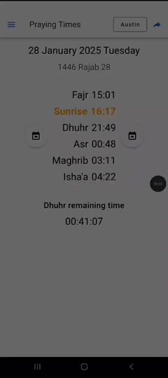

# Vakti App [(Türkçe)](BENİOKU.md)

  [](https://github.com/canbax/vaktiapp/blob/main/LICENSE)

Free, ad-free, open-source, and sleek Muslim Praying Times app. Available on [Vakti App.com](https://vaktiapp.com). Uses https://vakit.vercel.app/ for finding places. In other cases, it doesn't uses the Internet.

<a href="https://apps.apple.com/tr/app/vakti-app/id6743095525" target="_blank">
    
</a>
<a href="https://play.google.com/store/apps/details?id=com.vakti.app" target="_blank">
    
</a>

<p align="center">
  
</p>

## Features

### No-internet needed

Once a place is selected, it doesn't need internet to bring times data.

### Share times

Share the link for times. So your friends could **see the times with one click**. You can also embed times widget to your own website.

Prayer times for [Ankara](https://www.vaktiapp.com/share?city=311034&theme=light&isShowHijri=1&year=YYYY&month=MMMM&weekDay=DDDD&time=XX%3AYY%3AZZ&method=Turkey&madhab=shafi&zoom=1&language=tr), [İstanbul](https://www.vaktiapp.com/share?city=311922&theme=light&isShowHijri=1&year=YYYY&month=MMMM&weekDay=DDDD&time=XX%3AYY%3AZZ&method=Turkey&madhab=shafi&zoom=1&language=tr), [İzmir](https://www.vaktiapp.com/share?city=311955&theme=light&isShowHijri=1&year=YYYY&month=MMMM&weekDay=DDDD&time=XX%3AYY%3AZZ&method=Turkey&madhab=shafi&zoom=1&language=tr)

<p align="center">
  
</p>

### Hijri Calender

You can see religious days from the menu item _"Religious Days"_.

Hijri calendar calculations are without using any third-party application. The logic is inside [HijriDate.ts file](https://github.com/canbax/vaktiapp/blob/master/src/util/HijriDate.ts)

### Various Customizations

- Multiple themes (_Dark_ or _Light_)
- Change language (Türkçe, English, Deutsch, Italian, Pусский, Española, فارسی, Français, Chinese, عربى, Indonesia, Kazakh, Korean, Kyrgyz, Malay)
- Show or hide hijri date
- Change zoom level
- Multiple date formats
- Multiple time formats
- Multiple times calculation methods (Turkiye default)

## Project Setup for Developers

```sh
npm install
```

### Compile and Hot-Reload for Development

```sh
npm run dev
```

### Type-Check, Compile and Minify for Production

```sh
npm run build
```

### Run Unit Tests with [Vitest](https://vitest.dev/)

```sh
npm run test
```

### Run End-to-End Tests with [Playwright](https://playwright.dev)

```sh
# Install browsers for the first run
npx playwright install

# When testing on CI, must build the project first
npm run build

# Runs the end-to-end tests
npm run test:e2e
# Runs the tests only on Chromium
npm run test:e2e -- --project=chromium
# Runs the tests of a specific file
npm run test:e2e -- tests/example.spec.ts
# Runs the tests in debug mode
npm run test:e2e -- --debug
```

### Lint with [ESLint](https://eslint.org/)

```sh
npm run lint
```

### Sync mobile apps

```sh
npm run sync-apps
```
